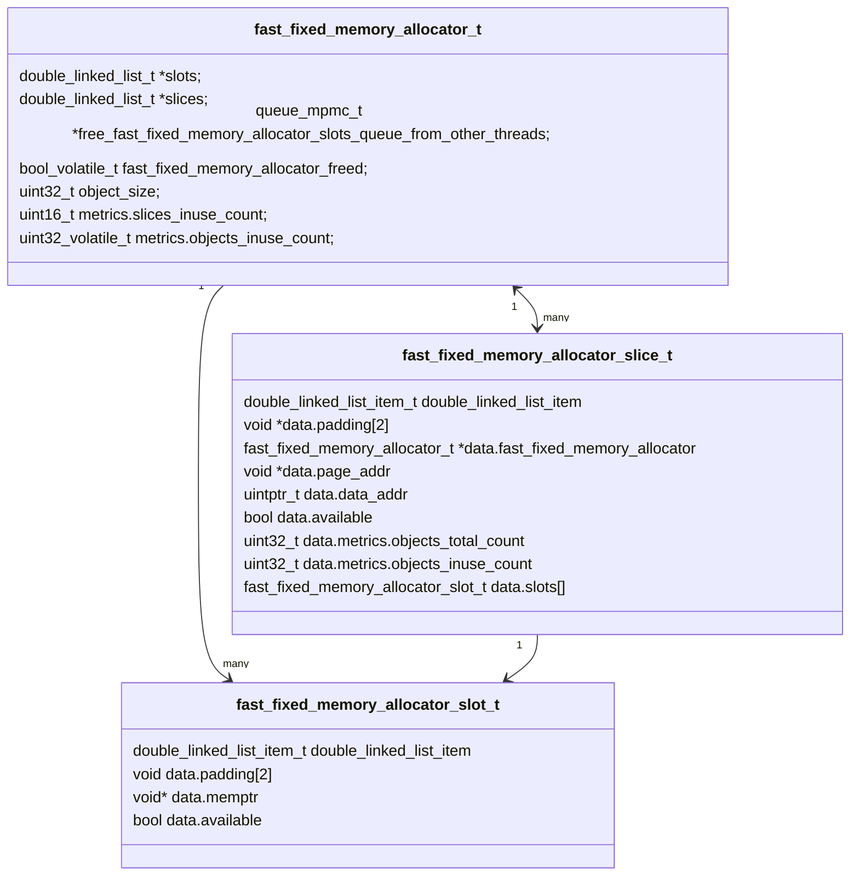
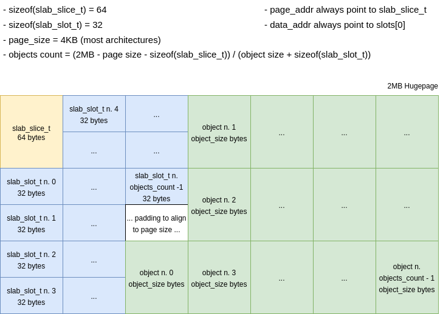
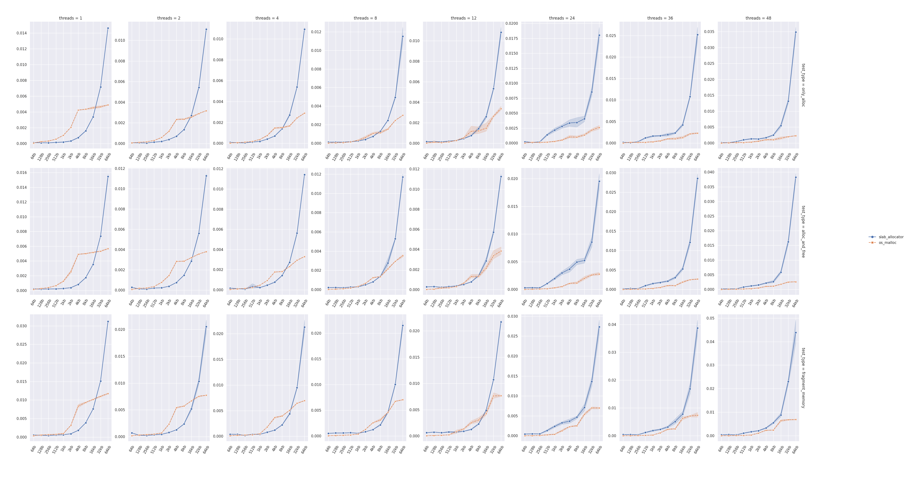

SLAB Allocator
==============

> Slab allocation is a memory management mechanism intended for the efficient memory allocation of objects. Compared to
> earlier mechanisms, it reduces fragmentation caused by allocations and deallocations. The technique is used to retain
> allocated memory that contains a data object of a certain type for reuse upon subsequent allocations of objects of the
> same type. It is analogous to an object pool, but only applies to memory, not other resources."
> -- <cite>[Wikipedia - Slab Allocation][1]</cite>

A lot of different algorithms and implementations for SLAB allocators are available nowadays but most of them focus on
simply reducing memory fragmentation, sacrificing speed or introducing layers of complexity that replace an issue with
another.

The goal, for cachegrand, is to have a *fast* and *flexible* SLAB allocator to provide better performances and the
ability to collect metrics.

### Principles

The implementation relies on 3 foundational blocks:
- a slab slot represents an object, it follows the data-oriented pattern whereas the metadata are kept separated from
  the actual data providing flexibility to achieve better performance but also to keep the data cacheline-aligned and,
  if needed, page-aligned.
- a slab slice represents a block of memory, the metadata themselves are held at the beginning followed by the metadata
  of the slab slots.
- a slab allocator that keeps track of the allocated slices, the available and occupied slots, the size of the objects,
  the metrics, it also allows to keep track of the allocated slices.

The terminology in place is slightly different from what can be commonly found on internet:
- a slab slice is a slab, for this implementation it matches a hugepage
- a slab slot is an object managed by the object cache

To be able to provide a `O(1)` for the alloc/free operations the SLAB allocator relies on the hugepages of 2MB, that are
the slab slices, and a double linked list used to track the available objects, kept at the beginning, and the used
objects kept at the end.

The SLAB allocator is lock-less in the hot-path and uses atomic operations in the slow-path, it's also numa-aware as
all the hugepages are fetched from the numa-domain executing the core.

### Data Structures



#### struct fast_fixed_memory_allocator (fast_fixed_memory_allocator_t)

```c
typedef struct fast_fixed_memory_allocator fast_fixed_memory_allocator_t;
struct fast_fixed_memory_allocator {
    double_linked_list_t *slots;
    double_linked_list_t *slices;
    queue_mpmc_t *free_fast_fixed_memory_allocator_slots_queue_from_other_threads;
    bool_volatile_t fast_fixed_memory_allocator_freed;
    uint32_t object_size;
    struct {
        uint16_t slices_inuse_count;
        uint32_volatile_t objects_inuse_count;
    } metrics;
};
```

The slab allocator is a container for the slab slices and can be used only by a specific thread for a specific object
size.

Because the slab allocator is per thread, the hugepages will be allocated in the numa domain of the thread, therefore
it's better, although not required, to bound the thread to a core of the cpu to get better performances.

The structure contains a double linked list of slots, sorted per availability where the available slots are
kept at the head and the in use slots are kept at the tail.
In this way, when it's necessary to fetch a slot it's possible to fetch it directly from the head if available.
If no slots are available, the slab allocator requests to the component that handles the cache of hugepages to provide
a new one, once received the slab allocator initializes a slab slice out of the hugepage and update the list of
available slots.
A hugepage can easily contain tens of thousands of 16 bytes objects, so the price is very well amortized for the small
objects, more explanation on the calculations are provided in the [fast_fixed_memory_allocator_slice_t](#struct-fast_fixed_memory_allocator_slice-fast_fixed_memory_allocator_slice_t)
section.

A queue called `free_fast_fixed_memory_allocator_slots_queue_from_other_threads` exists in case memory allocated by one thread gets freed by
another, the thread that doesn't own the memory passes it to the thread that ones it via a mpmc queue that uses atomic
operations to maintain a correct state.
In case the slab allocator has to fetch a slot but no more pre-allocated slots are available, then the queue is checked
to see if a thread any other thread has returned any object and, in case, it uses it. The object fetched from the queue
require fewer operations to be used.

The struct also contains a double linked list of slices, sorted per availability as well. When all the slots are freed
in a slice and this is returned to the hugepages cache to be reused.

This approach provides cache-locality and O(1) access in the best and average case - e.g. if there are pre-allocated
slots available.

#### struct fast_fixed_memory_allocator_slice (fast_fixed_memory_allocator_slice_t)

```c
typedef union {
    double_linked_list_item_t double_linked_list_item;
    struct {
        void* padding[2];
        fast_fixed_memory_allocator_t* fast_fixed_memory_allocator;
        void* page_addr;
        uintptr_t data_addr;
        bool available;
        struct {
            uint32_t objects_total_count;
            uint32_t objects_inuse_count;
        } metrics;
        fast_fixed_memory_allocator_slot_t slots[];
    } __attribute__((aligned(64))) data;
} fast_fixed_memory_allocator_slice_t;
```

A slab slice is a hugepage, the data of the structure is contained at the very beginning of it.

A union is used to reduce memory waste, double_linked_list_item_t has a `data` field that would be wasted in this case
because the pointer to the `double_linked_list_item` can be cast back to `fast_fixed_memory_allocator_slice_t`.

The field `page_addr` points to the beginning of the slice and although it's a duplication, because
`double_linked_list_item` it's the beginning of the slice itself, there is currently enough space for it and to improve
the code readability it's better to have it. This field is mostly used in the pointer math used to calculate the slot /
object memory address in `fast_fixed_memory_allocator_mem_free`.

The field `data_addr` points instead to the beginning of the slots, to `slots[0]`, and it's used as well in the pointer
math to calculate the slot / object index in `fast_fixed_memory_allocator_mem_free`. It's also worth to note that `data_addr`, for
performance reasons, is kept **always** page aligned.

The field `metrics.objects_total_count` is calculated using the following code
```c
size_t page_size = HUGEPAGE_SIZE_2MB;
size_t usable_page_size = page_size - os_page_size - sizeof(fast_fixed_memory_allocator_slice_t);
size_t fast_fixed_memory_allocator_slot_size = sizeof(fast_fixed_memory_allocator_slot_t);
uint32_t item_size = fast_fixed_memory_allocator->object_size + fast_fixed_memory_allocator_slot_size;
uint32_t slots_count = (int)(usable_page_size / item_size);
```

that can be simplified to
```
(2MB - page size - sizeof(fast_fixed_memory_allocator_slice_t)) / (object size + sizeof(fast_fixed_memory_allocator_slot_t))
```

Where `page size` is the size of page, usually 4kb, then `sizeof(fast_fixed_memory_allocator_slice_t)` is `64` bytes on 64bit architectures and
`sizeof(fast_fixed_memory_allocator_slot_t)` is `32` bytes. These last two structs are checked in the tests to ensure that the size matches the
expectation.

For `128` bytes objects a slice using the formula above `(2MB - 4Kb - 64) / (128 + 32)` can contain `13081` objects.

The `double_linked_list_item` is an item of the `fast_fixed_memory_allocator->slices` double linked list. As explained above, the
available slices are kept at the head meanwhile the in use ones at the tail.

Here an example of the memory layout of a slice



*(the schema hasn't been updated after renaming the memory allocator)*

#### struct fast_fixed_memory_allocator_slot (fast_fixed_memory_allocator_slot_t)

```c
typedef union {
    double_linked_list_item_t double_linked_list_item;
    struct {
        void *padding[2];
        void *memptr;
#if DEBUG==1
        bool available:1;
        int32_t allocs:31;
        int32_t frees:31;
#else
        bool available;
#endif
    } data;
} fast_fixed_memory_allocator_slot_t;
```

This is the actual slot, a union with the struct representing the item of the double linked list at the beginning.

The field `memptr` contains the pointer to the memory, in the slice, assigned to this slot calculated as follows
```c
fast_fixed_memory_allocator_slot->data.memptr = (void*)(fast_fixed_memory_allocator_slice->data.data_addr + (index * fast_fixed_memory_allocator->object_size));
```

The field `available` is marked true on creation and gets marked false when allocated or back to true when freed.

The `double_linked_list_item` is an item of the `fast_fixed_memory_allocator->thread_metadata[i]->slots` double linked list. As
explained above, the available slices are kept at the head meanwhile the in use ones at the tail.

### Benchmarks

*The benchmarks below are very obsolete and need to be regenerated from the benchmark in the benches' folder.*



[1]: https://en.wikipedia.org/wiki/Slab_allocation
