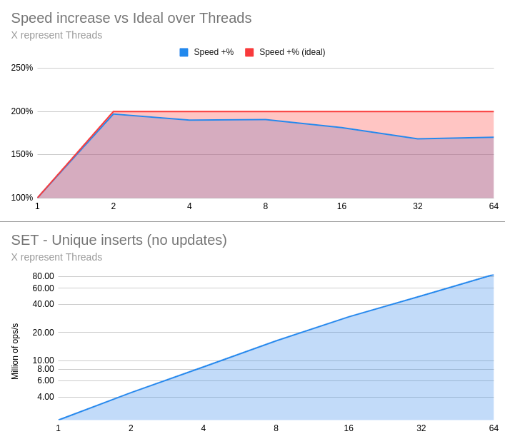
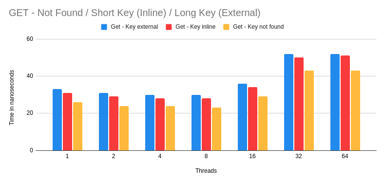
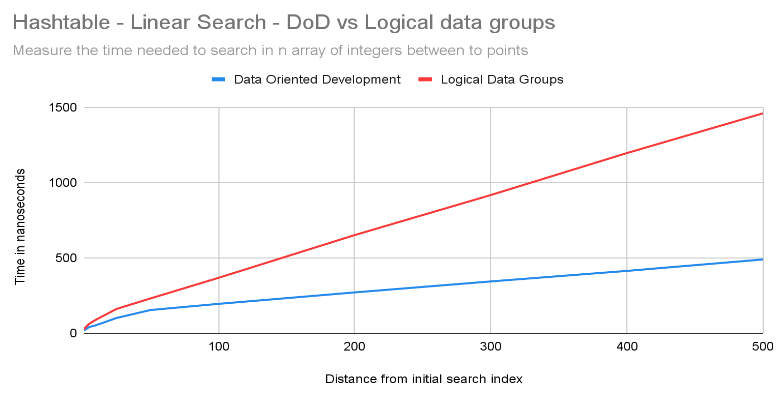
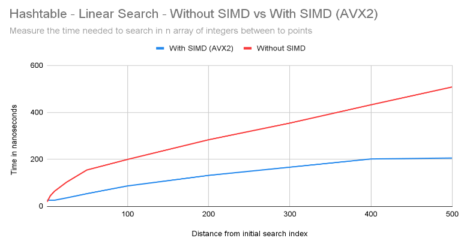

Hashtable
=========

cachegrand provides internally two different types of hashtables, a simple single-producer and single consumer one, and a multi-producer multi-consumer one, which is e.g. used to handle the indexes of the internal database.

This document focuses on the multi-producer multi-consumer hashtable which implements some state-of-the-art design patterns and approaches to be able to provide a lock-free and wait-free access to the data and it is capable of achieve up to **112 million GET ops/s** and up to **85 million UPSERT ops/s** on a 1 x AMD EPYC 7502P with 32 core and 64 hardware threads.

## Why a new hashtable?

One of the biggest challenges designing a platform capable of scaling up vertically to leverage all the resources available is avoiding contending these resources when managing them.

Although there are exceptions, threads synchronize and, if necessary, wait each other, to perform operations on the same resources, avoiding contention avoid forcing the threads to wait, wasting useful resources and/or increasing the time required to carry out the operations end-to-end.

When it comes to hashtables some platforms prefer to put a big lock around the it others prefer a share-nothing architecture, quite common in the Scala world.

While the last approach provides really good performances while keeping things simple, the share-nothing architecture requires partitioning the data and threating these partition as separated entities managed via one specific thread.
With this kind of architecture, all the contention is shifted on the components used to communicate between these nodes, which usually are queues: all the operations on the queues will be "gated" by locks or atomic operations, which are very low-level locks, therefore 16 threads translates to spreading the contention on 16 possible queues.

With cachegrand we took the challenge heads-on and developed a new approach - after 1 year of research and development - capable of spreading the contention all over the hashtable, proportionally to the size of it, dramatically reducing the gating effect!
The hashtable in cachegrand is split in "chunks" of 14 elements: 10000 buckets will be gated by 714 locks, 100000 will be gated by 7142 locks with these numbers growing even further minimizing the risk of contention.

## How is the contention spread?

As mentioned, the hashtable uses locks and although, generally speaking, mutexes or futexes are preferred, cachegrand relies on user-space [spinlocks](https://en.wikipedia.org/wiki/Spinlock) which, even if they can't prevent preemption, avoid making the thread sleep waiting for the lock to be freed and provide much better performances as the lock spins only for a few hundred of nanoseconds in average, with the worst case being about 1.2 microseconds.

The hashtable also works in tandem with other components (e.g. fibers) and depends on other design patterns (e.g. one thread per core and pinned threads) to achieve better performance.

To further maximize the performances, the hashtable also leverages a Data-Oriented Design and SIMD (Single Instruction Multiple Data) operations!

With the contention spread out all over the hashtable, when inserting new keys, which is slower than updating existing ones, the speed increase when doubling up the amount of threads writing almost doubles up, in the worst case scenario the speed bump is only 170%, and it's mostly limited by the saturation of the CPU SIMD execution units.

Locks are used only for UPSERTs and Read-Modify-write operations, the GET operations rely on [memory fences (or memory barriers)](https://en.wikipedia.org/wiki/Memory_barrier) to provide lock-free and wait-free GET operations.
The write operations are done in a certain sequence and use memory fences to communicate to the other cores and cpus which data are being changed, preserving the integrity of the operation.

With lock-free and wait-free GET operations, the time required to fetch a key is impacted only by the saturating the CPU SIMD execution units.

### Data-Oriented Design

Very often, to make code more readable, related set of information are stored together, to both improve code readability and maintainability, which should really be the goal.

There are exception to this rule though, in context where performances are needed denormalizing these data structures is often the key to fully exploit what a CPU can offer.
CPUs work in a very different way, when multiple data are bundled together the CPU has to load everything, even if only one property is being inspected!

Let's imagine a game engine trying to decide what has to be rendered on screen and what, instead, is outside the screen view and, for the sake of keeping things simple, let's say it can be decided checking just 1 boolean property which is re-computed on demand when the view changes.
If the game engine is handling 10000 objects and it relies on a loop to check this boolean property, these objects will have to be loaded from the memory and inspected, which is a fairly slow operation. Modern CPUs have a lot of cache, but often they get polluted by other operations running so, for the sake of simplicity, let's ignore them for a moment.
If these objects are 250 bytes large, which is a fairly small amount, the CPU will have to load and iterate over 2.38MB of memory.

When loading or storing data to or from the memory, the CPU reasons in terms of "cache-lines" which are sequence long 64 bytes, for most of the architectures, so loading 2.38MB would require loading at least 39063 cache-lines which is a **massive** amount.
Loading data from memory is particularly slow, that's why CPUs have caches, it can take several hundred cycles to load one single cache-line!

Now let's try to imagine that instead of having just 1 array of game objects we would have 2, one containing the game objects themselves and the second one containing just this boolean property which is represented using a 0/1 byte.
The visibility status of 10000 game objects can be represented using an array of 10000 bytes, which would require loading at least 157 cache-lines.

This very simple exercise helps to see how data can be optimized to be loaded faster, not only from the memory but also from the high level caches, this simple change brings a speed improvement of 2480%!

The hashtable in cachegrand leverage the same approach and keeps the hashes and the key-values split in two different arrays, the most frequent operation is searching and comparing hashes, having them all sequentially really helps to improve the performances.
The hashtable also reasons in terms of cache-lines and keeps 14 hashes in one single cache-line, reserving some space for some metadata that help with the GETs and with the UPSERTs ops.

With the data organized in this way cachegrand get up to a 400% speed bump when searching for an hash!

### SIMD (Single Instruction Multiple Data)

As mentioned in the previous section, cachegrand stores 14 hashes in a single cache-line and to maximize the load factor it allows to store values up to 32 cache-lines far-away from where the value should be, it means that potentially the hashtable might have to compare up to 448 hashes!

Although comparing numbers can be really fast, comparing up to 448 numbers hundreds or millions of times per second might really become a bottleneck!

Luckily, SIMD is our friend, especially when it comes to process sequences of data in memory like a list of hashes!

With SIMD, using the AVX2 instruction set, supported nowadays by every Intel or AMD cpu, one single instruction can compare up to 8 hashes! The hashtable in cachegrand leverages them to compare the 14 hashes with just 2 instructions, searching an hash in 32 cache-lines doesn't mean running 448 comparison instructions but only 64!

Leveraging SIMD cachegrand can get up to 250% performance improvements in the worst case scenario.

## Memory consumption

The hashtable requires a very little amount of memory:
- 14 hashes can be bundled together in a single 64 bytes cache-line
- a bucket requires 32 bytes

14 buckets in total require 512 bytes of memory.

This doesn't take into account the extra memory required by the internal database to hold the data and refers only the hashtable itself, used by the database to handle the primary indexes.

10 million buckets require only 348MB of memory.

## Future optimizations

A few optimizations are already planned out and under development:
- the higher-level components can take advantage of knowing that the hashtable spinlock is being locked for too lock and it's worth to yield the fiber and respond to other requests, this is also what the kernel does with the mutexes and futexes but doing it in user-space and in a controlled environment avoid switching to the kernel space as well as stalling all the requests being handled by the thread;
- currently the hashtable performs the UPSERT and the Read-Modify-Write operations in a way which requires a lot of memory fences, these can be optimized inverting the sequence of certain operations which would allow to reduce the amount of fences required to store or load the data;
