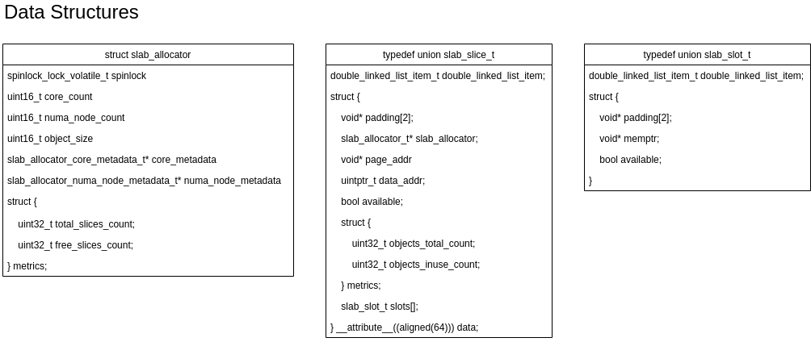
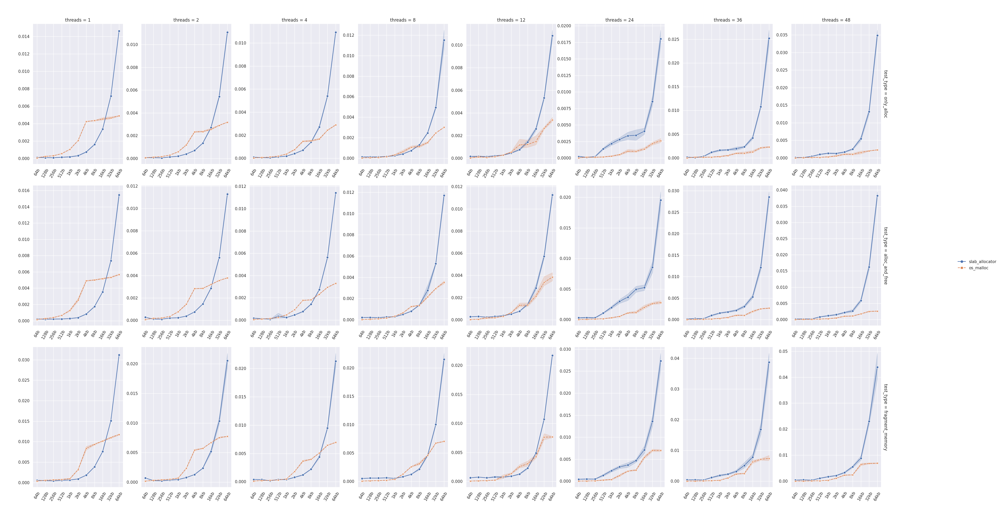

SLAB Allocator
==============

> Slab allocation is a memory management mechanism intended for the efficient memory allocation of
objects. Compared to earlier mechanisms, it reduces fragmentation caused by allocations and
deallocations. The technique is used to retain allocated memory that contains a data object of a
certain type for reuse upon subsequent allocations of objects of the same type. It is analogous
to an object pool, but only applies to memory, not other resources."
> -- <cite>[Wikipedia - Slab Allocation][1]</cite>

A lot of different algorithms and implementations for SLAB allocators are available nowadays but
most of them focus on simply reducing memory fragmentation, sacrificing speed or introducing layers
of complexity that replace an issue with another.

The goal, for cachegrand, was to have a *fast* and *flexible* SLAB allocator not only to reduce
the memory fragmentation issues but to provide internal metrics and improve the performance of
the critical parts doing memory allocation. 

### Principles

The implementation relies on 3 foundational blocks:
- a slab slot represents an object, it follows the data-oriented pattern whereas the metadata
  are kept separated from the actual data providing flexibility to achieve better performance but
  also to keep the data cacheline-aligned and, if needed, page-aligned.
- a slab slice represents a block of memory, the metadata themselves are held at the beginning
  followed by the metadata of the slab slots.
- a slab allocator that keeps track of the allocated slices, the available and occupied slots, the
  size of the objects, the metrics, it also allows to keep track of the allocated slices and slots
  per numa node and core for which they were allocated.

The terminology in place is slightly different from what can be commonly found on internet:
- a slab slice is a slab
- a slab slot is an object managed by the object cache

To be able to provide a `O(1)` for the alloc/free operations the SLAB allocator relies on the
hugepages of 2MB, that are the slab slices, and a double linked list used to track the available
objects, kept at the beginning, and the used objects kept at the end.

### Data Structures



#### struct slab_allocator

```c
typedef struct slab_allocator_core_metadata slab_allocator_core_metadata_t;
struct slab_allocator_core_metadata {
    double_linked_list_t* slots;
    struct { ... } metrics;
};

typedef struct slab_allocator_numa_node_metadata slab_allocator_numa_node_metadata_t;
struct slab_allocator_numa_node_metadata {
    double_linked_list_t* slices;
    struct { ... } metrics;
};

typedef struct slab_allocator slab_allocator_t;
struct slab_allocator {
    spinlock_lock_volatile_t spinlock;
    uint16_t core_count;
    uint16_t numa_node_count;
    uint16_t object_size;
    slab_allocator_core_metadata_t* core_metadata;
    slab_allocator_numa_node_metadata_t* numa_node_metadata;
    struct { ... } metrics;
};
```

The slab allocator is capable of allocating memory only for a specific object size.

The slab allocator maintains 2 metadata structures, one per core, called core_metadata, and another per numa node, called
numa_node_metadata, the former struct is allocated per core meanwhile the latter per numa node therefore it's necessary
to lock the slab_allocator using the spinlock field on the numa_node_metadata field.

The core_metadata struct contains a double linked list of slots, sorted per availability where the available slots are
kept at the head and the in use slots are kept at the tail.
In this way, when it's necessary to fetch a slot it's possible to fetch it directly from the head if available or procure
a new slice to satisfy the request.

The numa_node_metadata struct contains also a double linked list but of slices, sorted per availability as well. When
all the slots are freed in a slice and there is more than one slice already free for a core then it's marked as available
and any other allocation requested by a thread running on any other core using that numa node can fetch and use it
instead of allocating a new one.

Thanks to this approach the slices are in use by single cores, providing cache-locality, and they can be reused, if
free, only by cores on the same numa node, avoiding hitting numa bandwidth limitations.


#### struct slab_allocator

```c
typedef union {
    double_linked_list_item_t double_linked_list_item;
    struct {
        void* padding[2];
        slab_allocator_t* slab_allocator;
        void* page_addr;
        uintptr_t data_addr;
        bool available;
        struct {
            uint32_t objects_total_count;
            uint32_t objects_inuse_count;
        } metrics;
        slab_slot_t slots[];
    } __attribute__((aligned(64))) data;
} slab_slice_t;
```

A slice is, basically, an hugepage, the data of the structure above is contained at the very beginning of it.

An union is used to reduce memory waste, double_linked_list_item_t has a `data` field that would be wasted in this case
because the pointer to the `double_linked_list_item` can be casted back to `slab_slice_t`.

The field `page_addr` points to the beginning of the slice and although it's a duplication, because
`double_linked_list_item` it's the beginning of the slice itself, there is currently enough space for it and to improve
the code readability it's better to have it. This field is mostly used in the pointer math used to calculate the slot /
object memory address in `slab_allocator_mem_free`.

The field `data_addr` points instead to the beginning of the slots, to `slots[0]`, and it's used as well in the pointer
math to calculate the slot / object index in `slab_allocator_mem_free`. It's also worth to note that `data_addr`, for
performance reasons, is kept **always** page aligned.

The field `metrics.objects_total_count` is calculated using the following code
```c
size_t page_size = HUGEPAGE_SIZE_2MB;
size_t usable_page_size = page_size - slab_os_page_size - sizeof(slab_slice_t);
size_t slab_slot_size = sizeof(slab_slot_t);
uint32_t item_size = slab_allocator->object_size + slab_slot_size;
uint32_t slots_count = (int)(usable_page_size / item_size);
```

that can be simplified to
```
(2MB - page size - sizeof(slab_slice_t)) / (object size + sizeof(slab_slot_t))
```

Where `page size` is the size of page, usually 4kb, then `sizeof(slab_slice_t)` is `64` bytes on 64bit architectures and
`sizeof(slab_slot_t)` is `32` bytes. These last two structs are checked in the tests to ensure that the size matches the
expectation.

For `128` bytes objects a slice using the formula above `(2MB - 4Kb - 64) / (128 + 32)` can contain `13081` objects.

The `double_linked_list_item` is an item of the `slab_allocator->numa_node_metadata[i]->slices` double linked list. As
explained above, the available slices are kept at the head meanwhile the in use ones at the tail.

#### struct slab_allocator

```c
typedef union {
    double_linked_list_item_t double_linked_list_item;
    struct {
        void* padding[2];
        void* memptr;
        bool available;
    } data;
} slab_slot_t;
```

This is the actual slot, a very simple structure that like `slice_slab_t` is actually an union with the struct representing
the item of the double linked list at the beginning.

The field `memptr` contains the pointer to the memory, in the slice, assigned to this slot calculated as follow
```c
slab_slot->data.memptr = (void*)(slab_slice->data.data_addr + (index * slab_allocator->object_size));
```

The field `available` is marked true on creation and gets marked false when allocated or back to true when freed.

The `double_linked_list_item` is an item of the `slab_allocator->core_metadata[i]->slots` double linked list. As
explained above, the available slices are kept at the head meanwhile the in use ones at the tail.

### Memory Layout

#### Slice


### Benchmarks



[1]: https://en.wikipedia.org/wiki/Slab_allocation